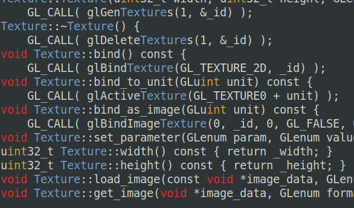

# mgrep

*grep*-like tool with nice colors.

## Usage
```console
./mgrep -f <files> -t <terms> [options]
```

Prints lines from `<files>` containing any of the `<terms>`.
If no files are specified, `stdout` is used instead.

## Options (not yet implemented!)
- `-c`: Case insensitive search
- `-a`: Line must contain all words
- `-m`: Enable multi-threading

## Looks like this:
